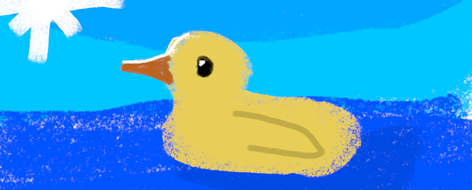

# 🦆 EduDuck 🦆

  
    
  
  
  

---

## ⚠️ Notice

This repository contains the **public core version** of EduDuck and is no longer under active development.

The production service at **eduduck.app** uses a **private repository** that extends this core with additional infrastructure, security, accounts, and scaling logic.

---

**AI-powered study companion** that transforms your notes into interactive quizzes, flashcards, and enhanced study materials.

---

## 📚 Table of Contents

- [✨ Features](#-features)
- [👤 Accounts](#-accounts)
  - [🆓 Free Account Benefits](#-free-account-benefits)
  - [🔮 Planned Account Features](#-planned-account-features)
  - [📌 Why Accounts?](#-why-accounts)
- [🚀 Quick Start](#-quick-start)
- [🎓 Who Is EduDuck For?](#-who-is-eduduck-for)
- [🛠️ Tech Stack](#tech-stack)
- [🎯 Roadmap](#-roadmap)
- [🤝 Contributions](#-contributions)
- [💰 Support the Project](#-support-the-project)
- [📄 License](#-license)

---

## ✨ Features

| Feature | Description |
|--------|-------------|
| **📝 Quiz Generator** | Upload notes → instant quizzes |
| **🗂️ Flashcard Generator** | Spaced repetition flashcards from any subject |
| **✨ Note Enhancer** | AI-powered summaries, diagrams, key concepts |
| **🦆 DuckAI** | Chat with your notes, get explanations & study tips |
| **📱 Multi-format** | TXT, PDF, PNG/JPG, handwritten notes via OCR |
| **🌍 Multi-language** | English, Polish, German, French, Ukrainian, Russian |
| **🎨 Modern UI** | Dark/light mode, mobile-first, glassmorphism design |

---

## 👤 Accounts

EduDuck supports **user accounts** to provide fair access limits and enable future personalization features.

> ⚠️ Account functionality exists **only in the production service (eduduck.app)**.  
> This public repository does **not** include authentication, limits, or account logic.

### 🆓 Free Account Benefits

Creating a free account unlocks:

- 🎯 **3 free uses per day** across:
  - Quiz Generator
  - Flashcard Generator
  - Note Enhancer
  - 🦆 DuckAI chat
- 🌍 Access across all supported languages
- 🔒 Usage tracking to prevent abuse and keep the service available

Free usage resets **daily**. No payment required.

---

### 🔮 Planned Account Features

Accounts are the foundation for upcoming features, including:

- 📚 Quiz & study history
- 📊 Learning progress tracking
- ☁️ Cloud-saved notes and generated materials
- ⭐ Premium tiers with higher or unlimited usage

---

### 📌 Why Accounts?

EduDuck relies on paid AI APIs.  
Accounts help:

- keep a **free tier available for students**
- prevent abuse
- sustainably scale the platform 🚀

---

## 🚀 Quick Start

### 1. Get a Free API Key  
*(Hugging Face, Google Gemini, or OpenAI)*

| Provider | Link | Free Tier |
|--------|------|-----------|
| 🤗 **Hugging Face** | https://huggingface.co/settings/tokens | 1M tokens/month |
| ⭐ **Google Gemini** | https://aistudio.google.com/app/apikey | 15 RPM |
| 🔥 **OpenAI** | https://platform.openai.com/api-keys | ~$0.001/quiz |

### 2. Try the Live Demo  
👉 **https://eduduck.app**

### 3. Paste your notes → Generate → Learn!

---

## 🎓 Who Is EduDuck For?

- Students who want to learn faster from their own notes  
- Teachers creating quizzes and study materials  
- Self-learners preparing for exams  
- Anyone tired of re-reading notes instead of testing knowledge

---

## 🛠️ Tech Stack

- **Frontend**: HTML5, CSS3 (CSS Variables), Vanilla JS, markdown-it  
- **Backend**: Python Flask, Flask-Login, Werkzeug, Render, MongoDB
- **Auth & Security**: Password hashing, session-based auth, usage limits  
- **Data Layer**: JSON serialization, in-memory caching  
- **AI**: Hugging Face Inference API, Google Gemini, OpenAI  
- **OCR**: Tesseract + custom preprocessing  

---

## 🎯 Roadmap

| Status | Feature |
|------|---------|
| ✅ Done | Basic quiz generation |
| ✅ Done | PDF/TXT/image upload + OCR |
| ✅ Done | Quiz & Flashcard visualization |
| ✅ Done | Note Enhancer |
| ✅ Done | DuckAI chat |
| ✅ Done | Multi-language support |
| ✅ Done | Dark mode + mobile UI |
| ✅ Done | Quiz difficulty levels |
| ✅ Done | Export generated material (.json) |
| ✅ Done | OpenAI API support |
| ✅ Done | Free daily usage (3/day) |
| ✅ Done | UI/UX improvements |
| 🔄 In Progress | User accounts & quiz history |
| ⏳ Planned | Study progress tracking |

---

## 🤝 Contributions

- **Art**: [netkv](https://github.com/netkv) ❤️  
- **Code & Testing**: [VxidDev](https://github.com/VxidDev)

**Sponsors**
---
**Deathtyr – $30**  
> “Invest in this guy, makes life easier (I really said that!)”

---

## 💰 Support the Project

  
  
Your support helps upgrade hosting and add premium features! 🦆

---

## 📄 License

MIT License — **required attribution** to this repository in all deployments.

Made with ❤️ by **VxidDev** — self-taught since June 2025

  

